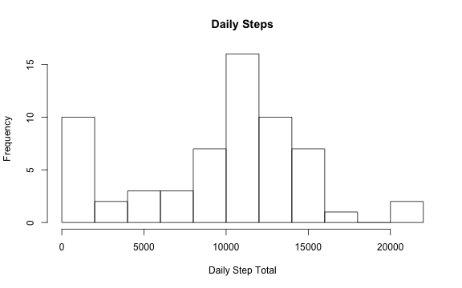
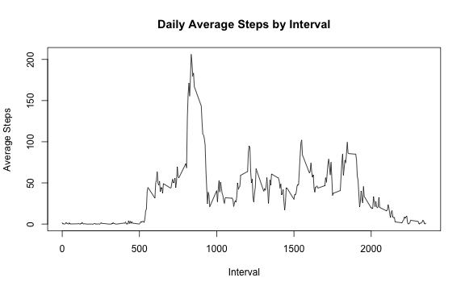
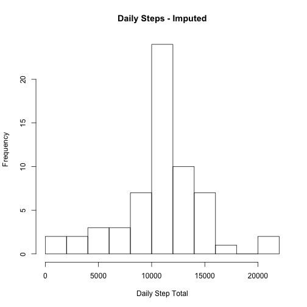
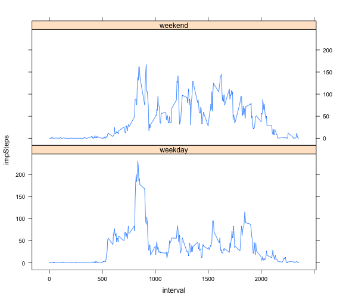

# Reproducible Research: Peer Assessment 1
Ventcha: July 2014  
Analysis of data from a personal activity monitoring device containing the number of steps taken, per 5 minute interval, over a two month period.
## Loading and preprocessing the data

```r
    #CHANGE for specific working directory
    setwd("~/Documents/coursera/Reproducible Research/RepData_peerassessment1")
    #load libraries needed for later use
    library(data.table)
    library(plyr)
    library(lattice)
    # Assume the activity file is present as the unzipped csv
    fulldata = read.csv("activity.csv",header = T,stringsAsFactors = F)
    fulldata$date = as.Date(fulldata$date)
    #calculate the sums per day, building a DF with Date and the Sum of steps for that date
    sums = tapply(fulldata$steps,fulldata$date,sum, na.rm = T)
    intervalDates = unique(data.frame(fulldata[,2]))
    dailysums = data.frame(cbind(intervalDates,sums))
```

## What is mean total number of steps taken per day?

```r
    par(mfcol = c(1,1)) #just in case: make it a single plot
    hist(dailysums$sums, breaks = 10,xlab="Daily Step Total",main = "Daily Steps")
```

 


```r
    #was intending to have echo=FALSE for this {r} block, but rubric requests to have it as true
    dailymean = round(mean(dailysums$sums, na.rm = T))
    dailymedian = median(dailysums$sums, na.rm = T)
    # also add these to a dataframe so that the imputed equivalents can be added later
    daysteps = data.frame("Original Data",dailymean,dailymedian)
    names(daysteps) = c("DataSet","Mean","Median")
```

    Daily mean is 9354 and median is 10395.

## What is the average daily activity pattern?

```r
    #take the mean of the steps, by interval, ignoring the NA
    intervalsums = tapply(fulldata$steps,fulldata$interval,mean, na.rm = T)
    #create a DF binding with the unique interval values (these are repeated daily so there are 288 )
    intervalcounts = data.frame(cbind(unique(data.frame(fulldata[,3])),intervalsums))
    names(intervalcounts) = c("interval","sum")
    #now show the plot of the average steps per interval
    plot(intervalcounts$interval,intervalcounts$sum,type ="l", main = "Daily Average Steps by Interval",
         xlab = "Interval", ylab = "Average Steps")
```

 


```r
#Which 5-minute interval, on average across all the days in the dataset, 
#contains the maximum number of steps?
    maxsteps = intervalcounts[intervalcounts$sum == max(intervalcounts[,2]),]
    msint = maxsteps$interval
    mssum = round(maxsteps$sum)
```
    Interval 835 has the maximum steps of 206.

## Imputing missing values
    The following logic prepares a new data.frame, 'imputedData' which has the NA step values replaced with the overall mean(step) values for that corresponding interval.

```r
    #take a copy to work on
    newdata = fulldata
    #now merge in the interval average data joined across interval values, so we have a new column
    ndj = join(newdata,intervalcounts,by = "interval")#plyr join retains the first df order ;-)
    #initialise a new column to the value of steps. This column will be the one updated
    ndj$impSteps = ndj$steps
    #There must be a better way, than performing a loop
    #This will replace any NA value of steps with the corresponding value for 
    # the average of that interval-steps 
    for (ii in 1:length(ndj$impSteps)) {
        if(is.na(ndj$impSteps[ii]))ndj$impSteps[ii] = ndj$sum[ii]
        else ndj$impSteps[ii] = ndj$steps[ii]
    }
    #extract the relevant column subsets into the imputed data.
    imputedData = ndj[,c(2,3,5)]
    origNA = sum(is.na(fulldata$steps))
    rm(ndj, newdata) #remove some temp variables
```
    There are 2304 missing values (steps = NA) in the original data set. These have all been substituted for the interval-mean in the imputed dataset.


```r
    isums = tapply(imputedData$impSteps,imputedData$date,sum, na.rm = T)
    #intervalDates = unique(data.frame(fulldata[,2]))
    idailysums = data.frame(cbind(intervalDates,isums))
    hist(idailysums$isums, breaks = 10,xlab="Daily Step Total",main = "Daily Steps - Imputed")
```

 

```r
    #Add the imputed values to the daysteps dataframe
    idailymean = round(mean(idailysums$isums, na.rm = T))
    idailymedian = round(median(idailysums$isums, na.rm = T))
    daysteps$DataSet = as.character(daysteps$DataSet)
    daysteps = rbind(daysteps,c("Imputed Data",idailymean,idailymedian))
#`r daysteps`
```
Comparison of Mean and Median:
- Original Data: Mean 9354 Median 10395
- Imputed Data: Mean 10766 Median 10766  

Original data had a number of days filled with NAs, showing up in the lowest bracket, whereas the imputed data has replaced these average values so will be more representative and removing some of the skew.  
## Are there differences in activity patterns between weekdays and weekends?
    This logic identifies each date as a daytpe of 'weekend' or 'weekday' and calculates the mean(steps) per interval across the two daytypes.

```r
    #weekdays processing
    #build a list of the values of "weekend" or "weekday" for each record
    dayType = sapply(imputedData$date,function(x) {if(weekdays(x) %in% c("Saturday","Sunday")) "weekend"
                                              else "weekday"})
    #bind this in, so the data now has date, interval,steps(imputed) and the new factor value
    imputedData = cbind(imputedData,dayType)
    
    #now perform a mean of Steps, with groupby across interval and daytype, across all the data
    tidy1 = data.table(imputedData)[,lapply(.SD,mean,na.rm=TRUE), by = list(interval,dayType)]
```
The following panel plot presents this daytype-interval mean(steps) for comparison.

```r
    #plot as a basic panel plot using lattice
    xyplot(impSteps ~ interval | dayType, data = tidy1, layout = c(1, 2), type = "l")
```

 

Weekdays show an earlier start to the 'steps' taken, suggesting a lie-in on the weekends. 

